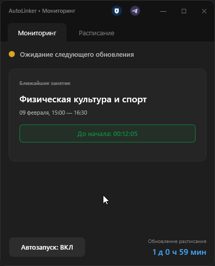

# 🔗 AutoLinker
<h3><i>Автоматическое подключение к онлайн-занятиям</i></h3>

**AutoLinker** — десктопное приложение для автоматического поиска и открытия ссылок на занятия в личном кабинете вуза.

Программа анализирует расписание, определяет актуальную пару и подключается к ней без ручного поиска по порталу.

[Скачать последнюю версию](https://github.com/W1xon/AutoLinker/releases/latest) • [Сообщить о проблеме](https://github.com/W1xon/AutoLinker/issues)

---

## Что делает AutoLinker

Каждый день одно и то же: открыть портал, авторизоваться, найти дисциплину, проверить время, открыть ссылку.

AutoLinker автоматизирует этот процесс:

- Определяет ближайшее занятие по расписанию
- Проверяет соответствие времени
- Находит актуальную ссылку на странице дисциплины
- Подключается автоматически или по нажатию кнопки
- Работает в фоновом режиме через трей
- Есть возможность отправки уведомлений в Telegram

Приложение не требует постоянного участия пользователя после первоначальной настройки.

---

## Технологии

- **WPF (.NET)** — десктопный интерфейс с тёмной темой
- **Playwright** — автоматизация браузера
- Логика сопоставления расписания и содержимого страницы
- Автоматическая проверка обновлений через GitHub

---

## Установка

1. Перейдите в раздел Releases.
2. Скачайте `AutoLinker.exe`.
4. Запустите.
5. Один раз укажите данные для входа в личный кабинет.

> При первом запуске может загрузиться браузерный движок Playwright (~100–200 MB). Это нормальный процесс и требуется только один раз.

---

## Скриншоты

  
  

---

  
<b>Автор:</b> Wixon

